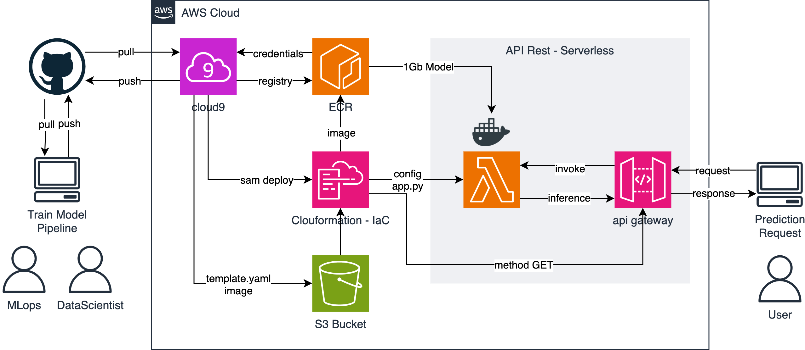
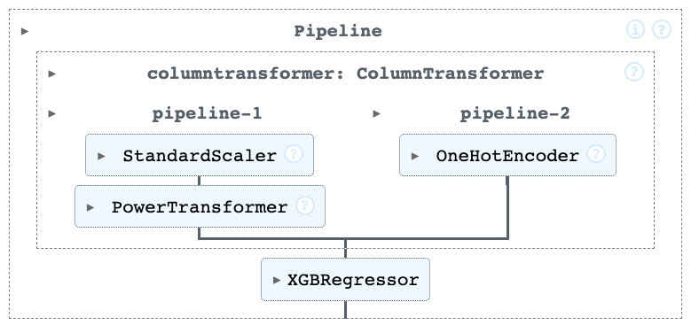
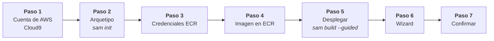
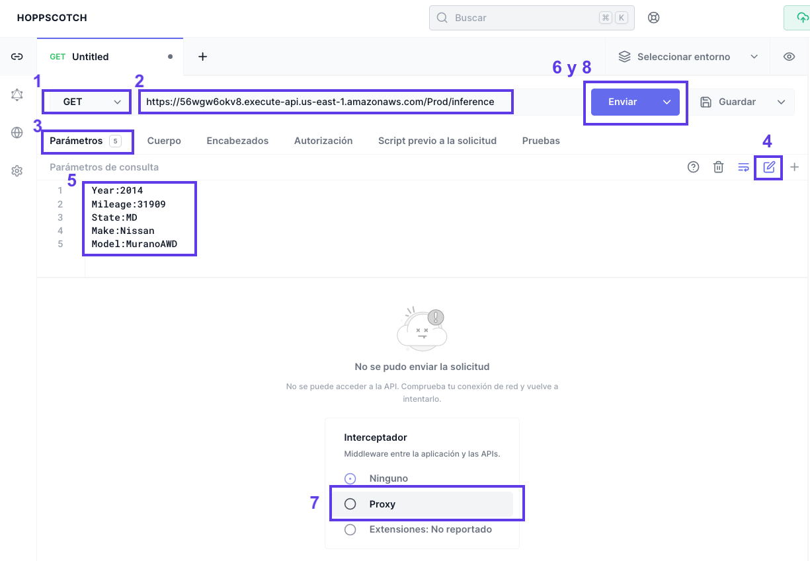
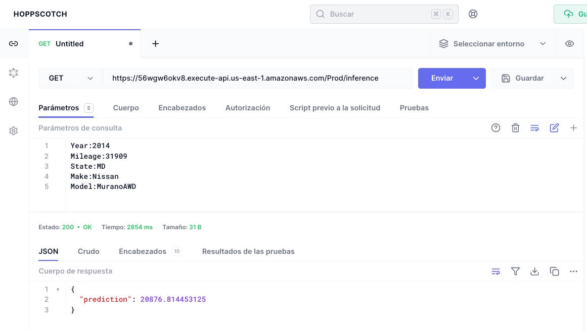
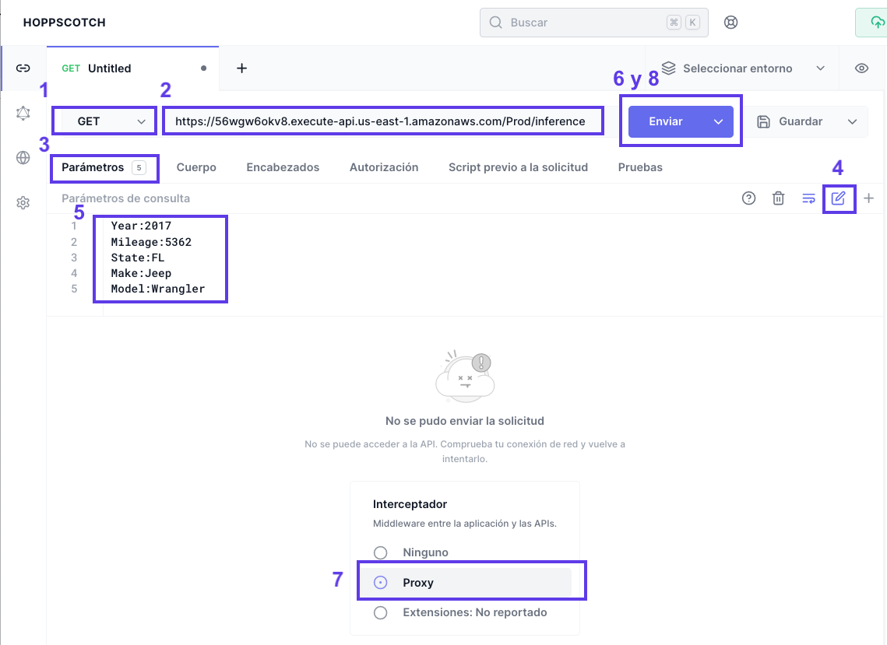
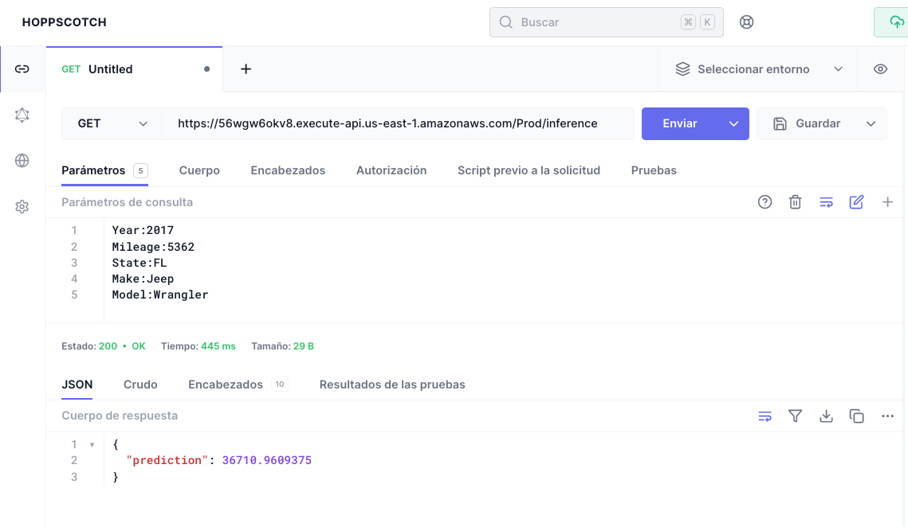

[](https://aws.amazon.com/es/)
[](https://peps.python.org/pep-0596/#schedule-first-bugfix-release)
[](https://github.com/dmlc/xgboost/actions)
[](https://hub.docker.com/r/amazon/aws-lambda-python)
[](vehicle_price_prediction/events/event.json)
[](https://hoppscotch.io/)


# VehiclePricePrediction

## Infraestructura - IaC
El respositorio actual permite desplegar la siguiente arquitectura para disponibilizar un modelo que predice los precios de un vehículo, previamente calibrado con optuna y entrenado con xgboostregressor.



## Modelo Predictivo

El pipeline que se [serializó](./vehicle_price_prediction/model_inference/model/) fue el que se muestra a continuación

<div style="text-align:center"></div>

En el pipeline-1 se hace un tratamiento para las variables predictoras numéricas, mientras que en el pipeline-2 se hace lo propio pero con las variables predictoras categorias.

Finalmente estas variables predictioras y de test que ya están separadas en muestras de entrenamiento y test son empleadas en un modelo xgboostRegressor con hiperparametros ya calibrados previamente con Optuna.

## Desplegando el Servicio

Se efectuan los siguientes pasos:



1. Al ingresar a AWS se levanta el servicio cloud9, con una instancia EC2 de por lo menos t3.medium y se clona este respositorio
   ```bash
   $ git clone https://github.com/HubertRonald/VehiclePricePrediction.git
   ```
2. Ingresar al directorio donde está el arquetipo y ejecutar el compilar el servicio con `sam`, más informacio [aquí](./vehicle_price_prediction/README.md)
   ```bash 
   $ cd VehiclePricePrediction/vehicle_price_prediction
   $ sam init
   ```
3. Como se requiere levantar el servicio ECR, para ello es necesario saber cuál es nuestro **accountID** (`$ aws configure list`) y la **region** que se emplea habitualmente para la cuenta antes encontrada (`$ aws sts get-caller-identity --query Account --output text`)
    ```bash
    $ aws --region <region> ecr get-login-password | docker login \
        --username AWS \
        --password-stdin <accountID>.dkr.ecr.<region>.amazonaws.com
    ```
4. Crear el respositorio de la imagen con el nombre de `vehicle-price-prediction`
    ```bash
    $ aws ecr create-repository \
      --repository-name "vehicle-price-prediction" \
      --image-tag-mutability MUTABLE \
      --image-scanning-configuration scanOnPush=true
    ```

    > Se obtiene el **"repositoryUri"**:
`<region>.dkr.ecr.us-east-1.amazonaws.com/vehicle-price-prediction`

5. Se despliega con `sam`, más informacio [aquí](./vehicle_price_prediction/README.md)
  ```bash
  $ sam deploy --guided
  ```
6. Diligenciar el wizard
    ```bash
    Configuring SAM deploy
    ======================

          Looking for config file [samconfig.toml] :  Found
          Reading default arguments  :  Success

          Setting default arguments for 'sam deploy'
          =========================================
          Stack Name [VehiclePricePrediction]: VehiclePricePrediction
          AWS Region [us-east-1]: us-east-1
          #Shows you resources changes to be deployed and require a 'Y' to initiate deploy
          Confirm changes before deploy [Y/n]: Y
          #SAM needs permission to be able to create roles to connect to the resources in your template
          Allow SAM CLI IAM role creation [Y/n]: Y
          #Preserves the state of previously provisioned resources when an operation fails
          Disable rollback [y/N]: N
          ModelInferenceFunction has no authentication. Is this okay? [y/N]: y
          Save arguments to configuration file [Y/n]: n

          Looking for resources needed for deployment:
          Creating the required resources...
    ```

7. Confirmar despliegue de plantilla compilada en clouformation.


## Consumiendo API

Para obtener (método **GET**) la prediccion del precio de un vehículo a partir del modelo previamente industrializado, se tienen las siguientes opciones

1. En la barra del navegador de tu preferencia

|Ejemplo 1 - E1 | Ejemplo 2 - E2 |
|---|---|
|https://56wgw6okv8.execute-api.us-east-1.amazonaws.com/Prod/inference?Year=2014&Mileage=31909&State=MD&Make=Nissan&Model=MuranoAWD |https://56wgw6okv8.execute-api.us-east-1.amazonaws.com/Prod/inference?Year=2017&Mileage=5362&State=FL&Make=Jeep&Model=Wrangler| 


2. En una terminal con alguna distribución Linux, Unix (macOS) o PowerShell de Windows (También puede emularse un [WSL](https://learn.microsoft.com/en-us/windows/wsl/install) en Windows)
   
    **Ejemplo 1 - E1**
    ```bash
    curl -G \
      -d 'Year=2014' \
      -d 'Mileage=31909' \
      -d 'State=MD' \
      -d 'Make=Nissan' \
      -d 'Model=MuranoAWD' \
      "https://56wgw6okv8.execute-api.us-east-1.amazonaws.com/Prod/inference"
    ```

    **Ejemplo 2 - E2**
    ```bash
    curl -G \
      -d 'Year=2017' \
      -d 'Mileage=5362' \
      -d 'State=FL' \
      -d 'Make=Jeep' \
      -d 'Model=Wrangler' \
      "https://56wgw6okv8.execute-api.us-east-1.amazonaws.com/Prod/inference"
    ```

3. Empleando [hoppscotch](https://hoppscotch.io/) (servicio similar a **postman** pero online)

    **Ejemplo 1 - E1**

    *Formulario E1*
    

    ---
    *Respuesta E1*
    


    **Ejemplo 2 - E2**

    *Formulario E2*
    
    
    ---
    *Respuesta E2*
    

    Para la carga masiva mostradas en las imagenes de arriba
    |Ejemplo 1 - E1 | Ejemplo 2 - E2 |
    |---|---|
    |Year:2014<br>Mileage:31909<br>State:MD<br>Make:Nissan<br>Model:MuranoAWD|Year:2017<br>Mileage:5362<br>State:FL<br>Make:Jeep<br>Model:Wrangler|

    Endpoint método **GET**
    ```bash
    https://56wgw6okv8.execute-api.us-east-1.amazonaws.com/Prod/inference
    ```


> Nota: Para los ejemplos 1 y 2, se obtienen las respuestas `20876.814453125` y `36710.9609375` respectivamente.


## Eliminar Recursos

1. Eliminar imagen de docker en el ECR
  ```bash
  aws ecr delete-repository --registry-id <account-id> --repository-name vehicle-price-prediction --force
  ```

2. Eliminar stack desde `sam`, más informacio [aquí](./vehicle_price_prediction/README.md)
```bash
sam delete --stack-name "VehiclePricePrediction"
```

3. Finalmente en `S3` eliminar aquel bucket creado por `sam` cuyo nombre contenga `VehiclePricePrediction`, hacer lo propio en `cloudformation`

## Fuentes

Documentación consultada y complementaria

1. [Deploying machine learning models with serverless templates](https://aws.amazon.com/es/blogs/compute/deploying-machine-learning-models-with-serverless-templates/)
2. [Serverless Rest API on AWS with Lambda and API Gateway using SAM (Serverless Application Model)](https://apoorv487.medium.com/serverless-rest-api-on-aws-with-lambda-and-api-gateway-using-sam-serverless-application-model-4aa3b550be1d)
3. [AWS Lambda Now Supports Up to 10 GB Ephemeral Storage](https://aws.amazon.com/es/blogs/aws/aws-lambda-now-supports-up-to-10-gb-ephemeral-storage/)

Para modelos predictivos más pequeños (sin docker)

4. [Deploying a Machine Learning Model to a Serverless Backend with SAM CLI](https://medium.com/carnegie-mellon-robotics-academy/going-serverless-for-your-ml-backend-with-sam-cli-5332912019ef)