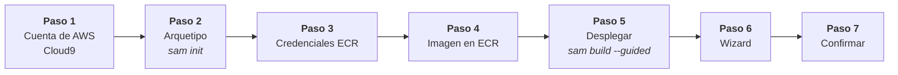

[](https://aws.amazon.com/es/)
[](https://peps.python.org/pep-0596/#schedule-first-bugfix-release)
[](https://github.com/dmlc/xgboost/actions)
[](https://hub.docker.com/r/amazon/aws-lambda-python)
[](vehicle_price_prediction/events/event.json)
[](https://hoppscotch.io/)


# VehiclePricePrediction

## Infraestructura - IaC
El respositorio actual permite desplegar la siguiente arquitectura para disponibilizar un modelo que predice los precios de un vehículo, previamente calibrado con optuna y entrenado con xgboostregressor.


## Modelo Predictivo

El pipeline que se [serializó](./vehicle_price_prediction/model_inference/model/) fue el que se muestra a continuación

<div style="text-align:center"></div>

En el pipeline-1 se hace un tratamiento para las variables predictoras numéricas, mientras que en el pipeline-2 se hace lo propio pero con las variables predictoras categorias.

Finalmente estas variables predictioras y de test que ya están separadas en muestras de entrenamiento y test son empleadas en un modelo xgboostRegressor con hiperparametros ya calibrados previamente con Optuna.

## Desplegando el Servicio

Se efectuan los siguientes pasos:



1. Al ingresar a AWS se levanta el servicio cloud9, con una instancia EC2 de por lo menos t3.medium y se clona este respositorio
   ```bash
   $ git clone https://github.com/HubertRonald/VehiclePricePrediction.git
   ```
2. Ingresar al directorio donde está el arquetipo y ejecutar el compilar el servicio con `sam`, más informacio [aquí](./vehicle_price_prediction/README.md)
   ```bash 
   $ cd VehiclePricePrediction/vehicle_price_prediction
   $ sam init
   ```
3. Como se requiere levantar el servicio ECR, para ello es necesario saber cuál es nuestro **accountID** (`$ aws configure list`) y la **region** que se emplea habitualmente para la cuenta antes encontrada (`$ aws sts get-caller-identity --query Account --output text`)
    ```bash
    $ aws --region <region> ecr get-login-password | docker login \
        --username AWS \
        --password-stdin <accountID>.dkr.ecr.<region>.amazonaws.com
    ```
4. Crear el respositorio de la imagen con el nombre de `vehicle-price-prediction`
    ```bash
    $ aws ecr create-repository \
      --repository-name "vehicle-price-prediction" \
      --image-tag-mutability MUTABLE \
      --image-scanning-configuration scanOnPush=true
    ```

    > Se obtiene el **"repositoryUri"**:
`<region>.dkr.ecr.us-east-1.amazonaws.com/vehicle-price-prediction`

5. Se despliega con `sam`, más informacio [aquí](./vehicle_price_prediction/README.md)
  ```bash
  $ sam deploy --guided
  ```
6. Diligenciar el wizard
    ```bash
    Configuring SAM deploy
    ======================

          Looking for config file [samconfig.toml] :  Found
          Reading default arguments  :  Success

          Setting default arguments for 'sam deploy'
          =========================================
          Stack Name [VehiclePricePrediction]: VehiclePricePrediction
          AWS Region [us-east-1]: us-east-1
          #Shows you resources changes to be deployed and require a 'Y' to initiate deploy
          Confirm changes before deploy [Y/n]: Y
          #SAM needs permission to be able to create roles to connect to the resources in your template
          Allow SAM CLI IAM role creation [Y/n]: Y
          #Preserves the state of previously provisioned resources when an operation fails
          Disable rollback [y/N]: N
          ModelInferenceFunction has no authentication. Is this okay? [y/N]: y
          Save arguments to configuration file [Y/n]: n

          Looking for resources needed for deployment:
          Creating the required resources...
    ```

7. Confirmar despliegue de plantilla compilada para clouformation


```bash
aws ecr delete-repository --registry-id <account-id> --repository-name vehicle-price-prediction --force
```

## Consumiendo API

Para obtener la prediccion del precio de un vehículo a partir del modelo previamente industrializado se tienen las siguientes opciones

1. En una terminal con alguna distribución Linux, Unix (macOS) o PowerShell de Windows (También puede emularse un [WSL](https://learn.microsoft.com/en-us/windows/wsl/install) en Windows)

```bash
curl -G \
  -d 'Year=2014' \
  -d 'Mileage=31909' \
  -d 'State=MD' \
  -d 'Make=Nissan' \
  -d 'Model=MuranoAWD' \
  "https://56wgw6okv8.execute-api.us-east-1.amazonaws.com/Prod/inference"
```
2. En la barra del navegador de tu preferencia

```bash

```

3. Empleando [hoppscotch](https://hoppscotch.io/) (servicio similar a **postman** pero online)


## Datos Preditores

Como las consultas se realizan sin una capa front, se proporcionan algunos ejemplos usando el envio masivo con [hoppscotch](https://hoppscotch.io/)

